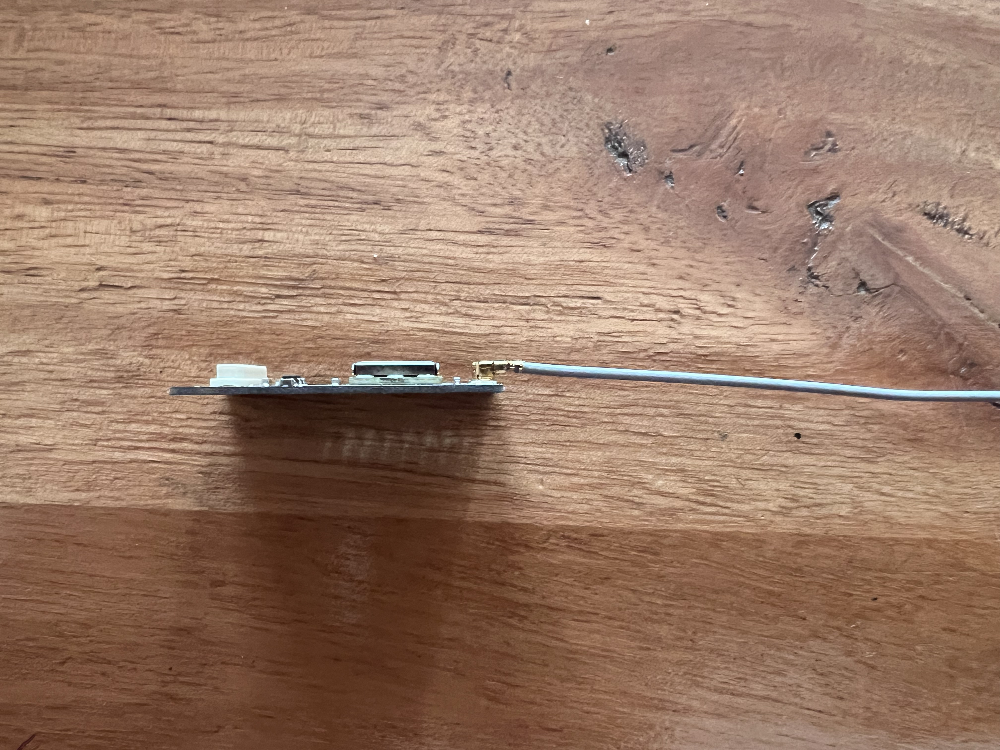
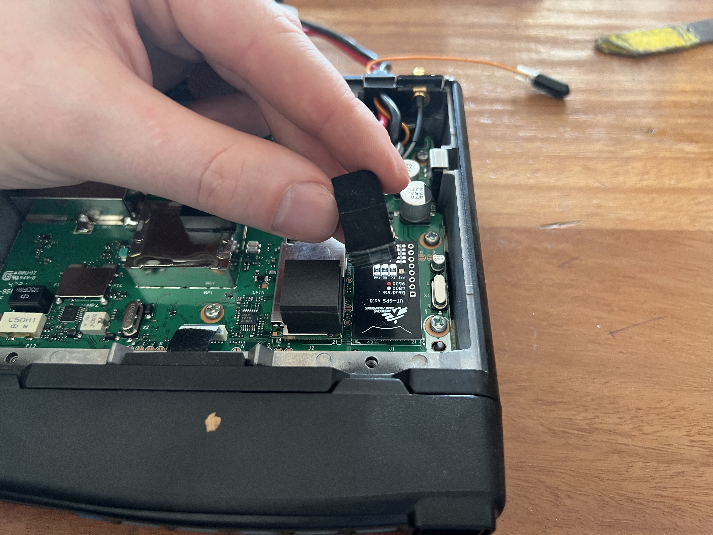
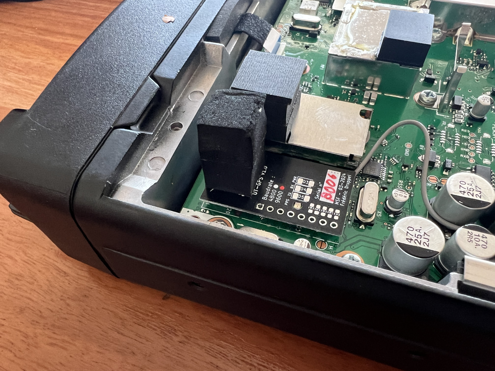

# UT-GPS

A small, internal, and open-source GPS module for ICOM IC-5060 and IC-6060 radios.

## Table of Contents

- [UT-GPS](#ut-gps)
  - [Table of Contents](#table-of-contents)
  - [Introduction](#introduction)
  - [First revision](#first-revision)
    - [Details](#details)
    - [Installation](#installation)
  - [Module Design Specifications](#module-design-specifications)
  - [Module Design Choices](#module-design-choices)
    - [v1.0](#v10)
      - [Requirements](#requirements)
      - [Component choice](#component-choice)
      - [Cost breakdown](#cost-breakdown)
        - [Full prototype with debug LEDs](#full-prototype-with-debug-leds)
        - [Integration prototype with battery backup](#integration-prototype-with-battery-backup)
        - [Integration prototype without battery backup](#integration-prototype-without-battery-backup)
  - [Acknowledgements](#acknowledgements)

## Introduction

The UT-GPS module is a small, internal, and open-source GPS module for ICOM IC-5060 and IC-6060 radios. It is designed to fit in the internal expansion port, with the same form factor as the ICOM UT-126H digital module, and provide a UART NMEA GPS module with 4800/9600 baud rate. The module is designed to be compatible with a 5V supply, and provide a 5V antenna supply. The module has a UFL antenna connector, and test pads for VCC, GND, TX, RX and PPS.  
This module was created to replace existing external GPS modules which are often out of stock, soon to be end of life, expensive, and only compatible with GPS satellites. The UT-GPS module is designed to be compatible with GPS, GLONASS, Galileo, and Beidou satellites, and provide  more reliable position data.

## First revision

### Details

The first revision uses the u-blox MAX-M10 GPS module, and omits battery backup to facilitate shipping (no lithium batteries).

It was first tested on terrain in Burundi, with 10 hand-assembled prototypes; after validating those prototypes 50 assembled units were ordered from [Aisler](https://aisler.net/), 35 of which have been deployed in Central African Republic.

### Installation

#### Kit overview

The kit contains the following items (top to bottom, left to right) :

- U.FL to SMA pigtail
- UT-GPS module
- SMA GPS Antenna
- Foam pad

#### 1. Remove the radio from the vehicle

Refer to the installer/mechanic/radio operator who installed the radio for exact steps to remove the radio from the vehicle.

#### 1b. Remove existing GPS module

If an existing GPS module is present, remove it from the vehicle.

#### 2. Remove the bottom cover of the radio

Remove the 4 screws holding the bottom cover of the radio.

#### 3. Cut the plastic tab next to the power cable at the back of the housing

> Note : be careful not to cut the power cables.

Once removed you should have a hole that looks like this :

#### 4. If not connected, connect the U.FL to SMA cable to the UT-GPS module

The U.FL to SMA cable should be connected to the U.FL connector on the UT-GPS module.

Once connected, the assembly should look like this :

#### 5. Insert the UT-GPS module in the expansion port

The UT-GPS module should be inserted in the expansion port, with the U.FL connector facing the back of the radio.

> Note : Be careful while connecting the UT-GPS, as the expansion port is fragile.

#### 6. Slot the SMA connector in the back of the radio

Be careful to route the coaxial cable correctly, and not to pinch it.

#### 6b. If not present, put foam pad on top of the module

The foam pad should be placed on top of the module over the MSF logo. This will prevent the module from moving around and disconnecting in the radio due to vehicle vibrations.

#### 7. Reassemble the radio

Put the cover back on the radio, and screw it back in place.

#### 8. Flash the radio with new profile

The radio should be flashed with a new profile that includes the GPS module on the **internal** connector at **9600** baud.  
This profile should be available to the radio operator who installed the radio.

#### 9. Test with an external GPS antenna

To confirm the module is working, connect an external GPS antenna to the SMA connector.

> Note : The antenna should be outside facing the sky, and have a clear view of the sky.  

   
*The GPS signal icon should be visible on the radio display (top center).*

#### 10. Install antenna in vehicle

The antenna can be installed on the roof of the vehicle, or on the dashboard behind the windshield. The antenna should have a clear view of the sky.

If an existing GPS module was present, the new GPS antenna can be put in its place.

> Note : be careful tot to pinch the coaxial cable, and to route it to the back of the radio mounting location.  
> Note : only use the provided SMA antenna.

#### 11. Reinstall the radio in the vehicle

Refer to the installer/mechanic/radio operator who installed the radio for exact steps to reinstall the radio in the vehicle.

#### 12. Test the GPS module

Turn on the radio, and check the GPS status. The GPS status should be visible on the radio display.  
*The same icon as in step 8 should be visible on the radio display.*

## Module Design Specifications

A.  Must have  

  1. UT-126H form factor (20x35mm)
  2. UART NMEA GPS module with 4800/9600 baud rate
  3. 5V Supply compatible
  4. 5V Antenna supply
  5. UFL Antenna connector
  6. Test pads for VCC, GND, TX, RX and PPS

B.  Nice to have

  1. Switchable antenna supply
  2. Backup battery circuitry
  3. Antenna short circuit detection & protection

C.  Optional

  1. Antenna connection detection
  2. Additional 2.54mm pitch header with VCC, GND, UART, PPS and I2C
  3. PPS LED
  4. TX/RX LEDs

## Module Design Choices

### v1.0

#### Requirements

- PCB
  - 2 layer
  - Test pads on user visible side (satisfies A6)
  - 20x35mm form factor (satisfies A1)
  - Silk screen on user visible side with checkable baud rate options
- Connectors
  - UFL Antenna connector (satisfies A5)
  - 2.54mm pitch header with VCC, GND, UART, PPS and I2C (satisfies C2)
- Battery backup with 6.8mm SDM 3V rechargeable lithium cell (satisfies B2)
- GPS Module : [u-blox MAX-M10](https://www.u-blox.com/en/product/max-m10-series?legacy=Current#Documentation-&-resources) (can satisfy A1, A2, A3 with regulator, A4, B1, B2, B3 and C1)
- LEDs on user visible side (satisfies C3 and C4)
- No antenna short circuit detection (does not satisfy B3 or C1)
- Constant 5V antenna supply (satisfies A4, but not B1)

#### Component choice

- [u-blox MAX-M10](https://www.u-blox.com/en/product/max-m10-series?legacy=Current#Documentation-&-resources)
- Battery : [SEIKO INSTRUMENTS MS518SE-FL35E](https://www.farnell.com/datasheets/3115182.pdf) ([Farnell](https://be.farnell.com/en-BE/seiko-instruments/ms518se-fl35e/battery-button-lithium-3-4mah/dp/3534575))
- U.FL : [HIROSE(HRS) U.FL-R-SMT-1(10)](https://www.farnell.com/datasheets/2691132.pdf) ([Farnell](https://be.farnell.com/en-BE/hirose-hrs/u-fl-r-smt-1-10/rf-coaxial-u-fl-straight-jack/dp/1688077))
- C1, C2 : [0603B105K250NT](https://www.lcsc.com/datasheet/lcsc_datasheet_2304140030_FH--Guangdong-Fenghua-Advanced-Tech-0603B105K250NT_C59302.pdf)
- L1 (Antenna supply inductor, 27nH) : [Murata LQG15HS27NJ02D](https://www.mouser.be/datasheet/2/281/1/JELF243B_0010-1699614.pdf)
- C4, C5, C6 (Antenna supply filter, 10nF, 16V, X7R) : [CC0603KRX7R0BB103](https://www.lcsc.com/datasheet/lcsc_datasheet_2304140030_YAGEO-CC0603KRX7R0BB103_C107059.pdf)
- 3.3V Regulator : [SPX5205M5-L-3-3/TR](https://www.lcsc.com/datasheet/lcsc_datasheet_2304140030_MaxLinear-SPX5205M5-L-3-3-TR_C6864.pdf)
- D1 : [RB551V-40](https://www.lcsc.com/datasheet/lcsc_datasheet_2308281443_hongjiacheng-RB551V-40_C7502699.pdf)
- D2 : [KINGBRIGHT KPTR-3216SURCK](https://www.farnell.com/datasheets/2045968.pdf)
- D3 : [XL-3216SURC](https://www.lcsc.com/datasheet/lcsc_datasheet_2402181505_XINGLIGHT-XL-3216SURC_C965822.pdf)
- D4, D5 : [XL-3216UOC](https://www.lcsc.com/datasheet/lcsc_datasheet_2402181505_XINGLIGHT-XL-3216UOC_C965823.pdf)
- R1 : [ERJPA3J100V](https://www.lcsc.com/product-detail/Chip-Resistor-Surface-Mount_PANASONIC-ERJPA3J100V_C441879.html)
- R2, R3, R4 : [CR0603-FX-3301ELF](https://www.lcsc.com/datasheet/lcsc_datasheet_2304140030_BOURNS-CR0603-FX-3301ELF_C203527.pdf)
- R5, R6, R7, R8 : [RC0603JR-07220RL](https://www.lcsc.com/datasheet/lcsc_datasheet_2304140030_YAGEO-RC0603JR-07220RL_C114683.pdf)

#### Cost breakdown

> Cost for one unit at 100pcs MOQ, without PCBA

##### Full prototype with debug LEDs

| Component                                  | Source | Cost ($) | Amount | Total ($) |
|--------------------------------------------|--------|----------|--------|-----------|
| PCB                                        | JLCPCB | 0.141    | 1      | 0.141     |
| LQG15HS27NJ02DLQG15HS27NJ02D 27nH inductor | LCSC   | 0.0065   | 1      | 0.0065    |
| U.FL-R-SMT-1(10) UFL connector             | LCSC   | 0.0.1177 | 1      | 0.1615    |
| SPX5205M5-L-3-3/TR 3.3V LDO regulator      | LCSC   | 0.1209   | 1      | 0.1209    |
| 0603B105K250NT 1uF 25V capacitor           | LCSC   | 0.0053   | 2      | 0.0106    |
| CC0603KRX7R0BB103 10nF 16V capacitor       | LCSC   | 0.0041   | 4      | 0.0164    |
| RC0603JR-07220RL 220 Ohm resistor          | LCSC   | 0.001    | 4      | 0.0040    |
| CR0603-FX-3301ELF 3.3k Ohm resistor        | LCSC   | 0.0062   | 3      | 0.0186    |
| ERJPA3J100V 10 Ohm resistor                | LCSC   | 0.0193   | 1      | 0.0193    |
| APTR3216SURCK Through-PCB LED              | LCSC   | 0.1032   | 1      | 0.1032    |
| MAX-M10S-00B GPS module                    | Mouser | 11.48    | 1      | 11.48     |
| AXK640347YG Connector                      | Mouser | 1.60     | 1      | 1.60      |
| MS518SE-FL35E Battery                      | Farnell| 2.15     | 1      | 2.15      |
| RB551V-40 Diode                            | LCSC   | 0.018    | 1      | 0.018     |
| XL-3216SURC Red LED                        | LCSC   | 0.0082   | 1      | 0.0082    |
| XL-3216UOC Orange LED                      | LCSC   | 0.0092   | 2      | 0.0184    |
|                                            |        |          |        |           |
| **Total**                                  |        |          |        | 15.8766   |

##### Integration prototype with battery backup

| Component                                  | Source | Cost ($) | Amount | Total ($) |
|--------------------------------------------|--------|----------|--------|-----------|
| PCB                                        | JLCPCB | 0.141    | 1      | 0.141     |
| LQG15HS27NJ02DLQG15HS27NJ02D 27nH inductor | LCSC   | 0.0065   | 1      | 0.0065    |
| U.FL-R-SMT-1(10) UFL connector             | LCSC   | 0.0.1177 | 1      | 0.1615    |
| SPX5205M5-L-3-3/TR 3.3V LDO regulator      | LCSC   | 0.1209   | 1      | 0.1209    |
| 0603B105K250NT 1uF 25V capacitor           | LCSC   | 0.0053   | 2      | 0.0106    |
| CC0603KRX7R0BB103 10nF 16V capacitor       | LCSC   | 0.0041   | 4      | 0.0164    |
| RC0603JR-07220RL 220 Ohm resistor          | LCSC   | 0.001    | 1      | 0.0010    |
| CR0603-FX-3301ELF 3.3k Ohm resistor        | LCSC   | 0.0062   | 3      | 0.0186    |
| ERJPA3J100V 10 Ohm resistor                | LCSC   | 0.0193   | 1      | 0.0193    |
| APTR3216SURCK Through-PCB LED              | LCSC   | 0.1032   | 1      | 0.1032    |
| MAX-M10S-00B GPS module                    | Mouser | 11.48    | 1      | 11.48     |
| AXK640347YG Connector                      | Mouser | 1.60     | 1      | 1.60      |
| MS518SE-FL35E Battery                      | Farnell| 2.15     | 1      | 2.15      |
| RB551V-40 Diode                            | LCSC   | 0.018    | 1      | 0.018     |
|                                            |        |          |        |           |
| **Total**                                  |        |          |        | 15.847    |

##### Integration prototype without battery backup

| Component                                  | Source | Cost ($) | Amount | Total ($) |
|--------------------------------------------|--------|----------|--------|-----------|
| PCB                                        | JLCPCB | 0.141    | 1      | 0.141     |
| LQG15HS27NJ02DLQG15HS27NJ02D 27nH inductor | LCSC   | 0.0065   | 1      | 0.0065    |
| U.FL-R-SMT-1(10) UFL connector             | LCSC   | 0.0.1177 | 1      | 0.1615    |
| SPX5205M5-L-3-3/TR 3.3V LDO regulator      | LCSC   | 0.1209   | 1      | 0.1209    |
| 0603B105K250NT 1uF 25V capacitor           | LCSC   | 0.0053   | 2      | 0.0106    |
| CC0603KRX7R0BB103 10nF 16V capacitor       | LCSC   | 0.0041   | 3      | 0.0164    |
| RC0603JR-07220RL 220 Ohm resistor          | LCSC   | 0.001    | 1      | 0.0010    |
| CR0603-FX-3301ELF 3.3k Ohm resistor        | LCSC   | 0.0062   | 2      | 0.0186    |
| ERJPA3J100V 10 Ohm resistor                | LCSC   | 0.0193   | 1      | 0.0193    |
| APTR3216SURCK Through-PCB LED              | LCSC   | 0.1032   | 1      | 0.1032    |
| MAX-M10S-00B GPS module                    | Mouser | 11.48    | 1      | 11.48     |
| AXK640347YG Connector                      | Mouser | 1.60     | 1      | 1.60      |
|                                            |        |          |        |           |
| **Total**                                  |        |          |        | 13.6687   |

## Acknowledgements

Made with ❤️, lots of ☕️, and lack of 🛌  
Published under CreativeCommons BY-SA 4.0

  
This work is licensed under a [Creative Commons Attribution-ShareAlike 4.0 International License](http://creativecommons.org/licenses/by-sa/4.0/).
